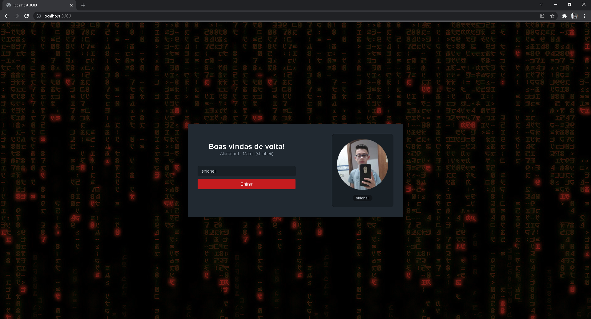

# aluracord-matrix
Projeto criado na Imersão React, realizada pela Alura

## O projeto
O projeto consistia em desenvolver uma interface usando o framework React. Fui desenvolvendo conforme os professores iam avançando no projeto, e me atentando aos conceitos. 

## Projeto funcional
- [Link](https://aluracord-matrix-o2dhtfopm-inative.vercel.app/)
